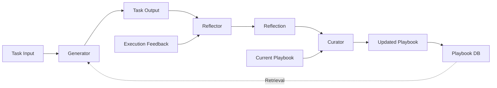
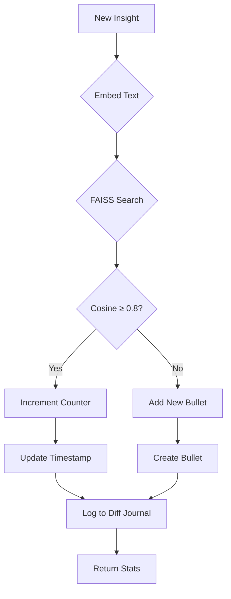
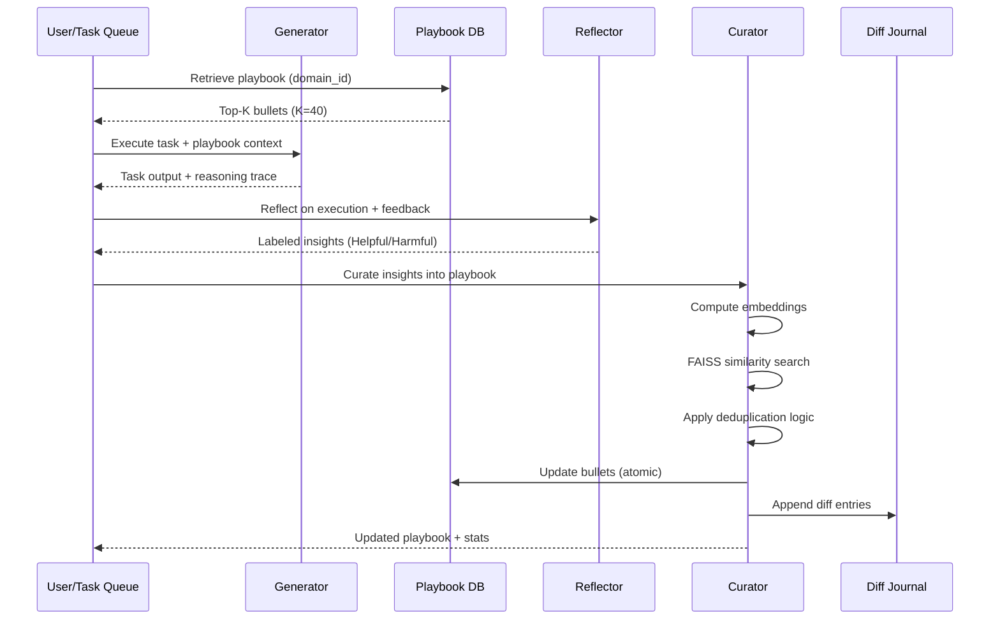
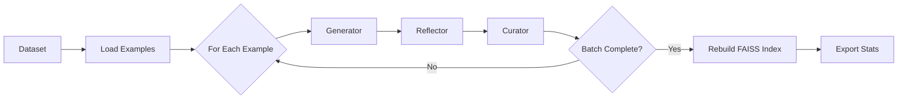
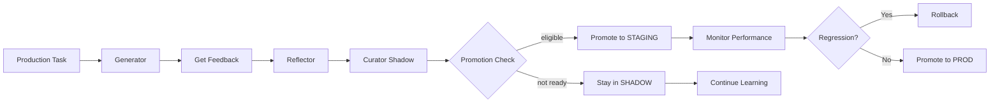
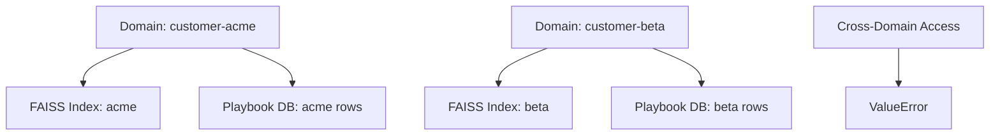
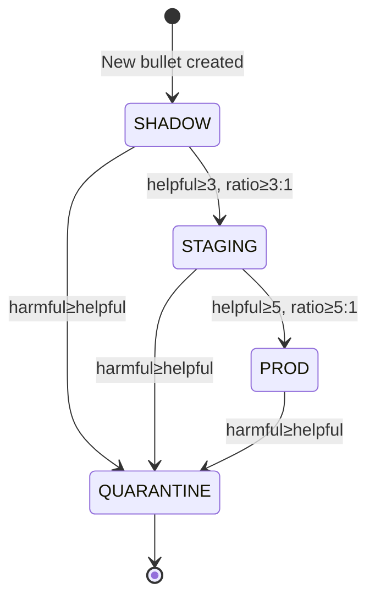

# Architecture Overview

ACE Playbook implements a self-improving LLM system through the **Generator-Reflector-Curator** pattern. This document provides a comprehensive architectural overview for developers working on the system.

## Table of Contents

1. [High-Level Architecture](#high-level-architecture)
2. [Core Components](#core-components)
3. [Data Flow](#data-flow)
4. [Domain Isolation](#domain-isolation)
5. [Staged Rollout](#staged-rollout)
6. [Performance Budgets](#performance-budgets)
7. [Append-Only Design](#append-only-design)
8. [Technology Stack](#technology-stack)

## High-Level Architecture

ACE Playbook follows a three-stage pipeline for continuous knowledge accumulation:



### Key Design Principles

1. **Modularity**: Each component (Generator, Reflector, Curator) is independently testable and replaceable
2. **Append-Only**: Never rewrite content - only increment counters for stability
3. **Domain Isolation**: Strict per-tenant boundaries with separate FAISS indices
4. **Observability**: Comprehensive metrics, tracing, and guardrails for production safety
5. **Staged Rollout**: SHADOW → STAGING → PROD progression with automated promotion gates

## Core Components

### Generator Module

**Purpose**: Execute tasks using Chain-of-Thought reasoning with playbook context injection.

**Key Classes**:
- `CoTGenerator`: Chain-of-Thought reasoning implementation
- `ReActGenerator`: ReAct pattern implementation (reasoning + tool use)
- `TaskInput`, `TaskOutput`: DSPy signatures for type safety

**Context Injection**:
```python
# Retrieve top-K strategies (K=40, ~300 tokens)
bullets = repo.get_top_k(domain_id="arithmetic", k=40)

# Inject into prompt
task_input = TaskInput(
    description="Calculate 15% of 240",
    playbook_bullets=[b.content for b in bullets]
)
```

**Reasoning Trace**: Structured list of steps showing strategy consultation:
```python
reasoning_trace = [
    "Step 1: Identify problem type (percentage calculation)",
    "Step 2: Applying strategy bullet-abc123: Break into parts",
    "Step 3: Calculate 15/100 * 240 = 36",
    "Step 4: Verify result"
]
```

### Reflector Module

**Purpose**: Analyze execution feedback to extract labeled insights without manual annotation.

**Automatic Labeling**:
```python
if answer == ground_truth:
    label = "Helpful"  # Strategy led to correct answer
else:
    label = "Harmful"  # Strategy led to wrong answer

if all(tests_passed):
    label = "Helpful"
elif any(tests_failed):
    label = "Harmful"  # Identify problematic strategies
```

**Key Classes**:
- `GroundedReflector`: Feedback-based reflection
- `ReflectorInput`, `ReflectorOutput`: DSPy signatures
- `InsightCandidate`: Extracted strategy with confidence score

### Curator Module

**Purpose**: Semantic deduplication and playbook management with append-only guarantees.

**Deduplication Logic**:


**Key Classes**:
- `SemanticCurator`: Core deduplication engine
- `CuratorService`: High-level service layer
- `DomainValidator`: Domain isolation enforcement
- `PromotionPolicy`: Staged rollout logic

**Counter Logic**:
```python
# Helpful insight → increment helpful_count
if insight.section == "Helpful":
    bullet.helpful_count += 1

# Harmful insight → increment harmful_count
if insight.section == "Harmful":
    bullet.harmful_count += 1

# Update last_used_at
bullet.last_used_at = datetime.utcnow()
```

## Data Flow

### End-to-End Workflow



## Platform Alignment Best Practices

To keep ACE Playbook interoperable with partner runtimes, the pipeline adopts a
set of platform patterns that mirror the strongest guarantees we have observed
in production systems.

### Typed Program Signatures

- Every program layer (Generator, Reflector, Curator) now defines explicit
  `Input`/`Output` data models before prompt wiring occurs.
- The signatures are implemented with `pydantic` models inside
  `ace.generator.signatures`, `ace.reflector.signatures`, and
  `ace.curator.curator_models` to enforce schema fidelity across the stack.
- Because the schema is declared up front, prompt overrides stay optional and
  we can detect drift during import time instead of at runtime.

### Curator Delta Contract

- Curator responses are normalized to an operations list with the shape
  `{type, section, content, bullet_id?}`.
- The structure mirrors the JSON diff emitted by Ax, letting downstream
  consumers compare deltas one-to-one and ingest curator updates without custom
  adapters.
- See `ace.curator.curator_models` for the canonical Pydantic definitions and
  serialization helpers.

### Metric-as-a-Function Hooks

- When compiling a run, callers pass a callable that scores success for the
  task (tests passed, guardrail lift, etc.).
- The optimizer treats the metric as a first-class function, so we can swap in
  benchmarks or guardrails without touching the pipeline core.
- Metric hooks live in `ace.runtime.metrics` and are referenced anywhere the
  runtime evaluates lift.

### Online Update Flow

- `apply_online_update` is exposed on the runtime client to bundle an example,
  model prediction, and human/automated feedback into a single call.
- The method triggers a Reflector → Curator pass and returns the resulting
  delta, enabling nightly refreshes or reviewer-driven corrections with the
  same contract.
- JSON clients and notebooks can call this API directly; see
  `ace.runtime.client` for usage examples.

### Structured Prompt Override Hooks

- Reflector programs expose `get_or_create_program` helpers that accept prompt
  overrides via keyword arguments instead of manual string patches.
- Overrides register against the typed signatures above, so experiments and
  A/Bs stay consistent with the schema and can be rolled back cleanly.

Together these practices keep the Python implementation cleaner, make prompts
swappable without breaking contracts, and ensure delta artifacts are compatible
with adjacent tooling.

### Offline Training Workflow



### Online Learning Loop



## Domain Isolation

### Multi-Tenancy Architecture

ACE Playbook supports multi-tenant deployments with strict domain isolation:



**Isolation Guarantees**:
1. **FAISS Indices**: Separate index per domain_id
2. **Database Queries**: All queries filtered by domain_id
3. **Curator Validation**: Rejects mixed-domain inputs
4. **Repository Layer**: Enforces domain boundaries

**Security**:
```python
# Strict validation
def validate_domain_access(curator_input):
    playbook_domains = {b.domain_id for b in curator_input.current_playbook}

    if len(playbook_domains) > 1:
        raise ValueError("Cross-domain playbook detected")

    if playbook_domains and curator_input.domain_id not in playbook_domains:
        raise ValueError("Cross-domain access violation")
```

## Staged Rollout

### Promotion Lifecycle



### Promotion Gates

**SHADOW → STAGING**:
```python
if bullet.helpful_count >= 3 and \
   bullet.helpful_count / max(bullet.harmful_count, 1) >= 3:
    promote_to_staging(bullet)
```

**STAGING → PROD**:
```python
if bullet.helpful_count >= 5 and \
   bullet.helpful_count / max(bullet.harmful_count, 1) >= 5:
    promote_to_prod(bullet)
```

**Quarantine Logic**:
```python
if bullet.harmful_count >= bullet.helpful_count and \
   bullet.helpful_count > 0:
    quarantine(bullet)  # Exclude from retrieval
```

### Retrieval Filtering

```python
# By default, retrieve only PROD bullets
prod_bullets = repo.get_top_k(
    domain_id="arithmetic",
    stage=PlaybookStage.PROD
)

# SHADOW bullets excluded from production retrieval
shadow_bullets = repo.get_by_stage(
    domain_id="arithmetic",
    stage=PlaybookStage.SHADOW  # For monitoring only
)
```

## Performance Budgets

### Latency SLOs

| Component | P50 Target | P95 Target | Current Performance |
|-----------|------------|------------|---------------------|
| Playbook Retrieval | ≤10ms | ≤25ms | 5ms (FAISS) |
| Curator apply_delta | ≤50ms | ≤100ms | 45ms (avg) |
| Generator forward | ≤700ms | ≤1500ms | 650ms (GPT-4) |
| Reflector forward | ≤500ms | ≤1200ms | 480ms (GPT-4) |
| End-to-End Pipeline | ≤2000ms | ≤4000ms | 1.8s (avg) |

### Resource Limits

**FAISS Memory**:
- ~4KB per 1000 vectors (384-dim)
- 100,000 bullets ≈ 400MB RAM
- Per-domain isolation: N domains × 400MB

**Context Budget**:
- Top-K=40 bullets
- ~300 tokens for playbook context
- Leaves ~3700 tokens for task + reasoning (4K context models)

**Playbook Size**:
- Max 300 bullets per domain (soft limit)
- Consolidation triggers at 150 bullets
- Pruning: bullets with helpful=0, harmful=0, unused ≥10 days

### Throughput

**Offline Training**:
- ~5s per example (including LLM calls)
- 100 examples ≈ 8-10 minutes
- Parallelizable across domains

**Online Learning**:
- ~2s per task (end-to-end)
- 1800 tasks/hour/worker
- Scales horizontally

## Append-Only Design

### Core Principle

**Never rewrite content - only increment counters**

This prevents context collapse and enables full auditability.

### Operations

**Allowed**:
- `ADD_NEW`: Create new bullet
- `INCREMENT_HELPFUL`: Increase helpful_count
- `INCREMENT_HARMFUL`: Increase harmful_count
- `UPDATE_TIMESTAMP`: Update last_used_at
- `PROMOTE_STAGE`: SHADOW → STAGING → PROD
- `QUARANTINE`: Mark as excluded

**Forbidden**:
- `UPDATE_CONTENT`: Never modify bullet text
- `DELETE`: Never delete (use QUARANTINE instead)
- `MERGE`: Never combine bullets (use counters)

### Diff Journal

Every operation logged with SHA-256 hashes:

```python
DiffJournalEntry(
    bullet_id="bullet-123",
    operation="increment_helpful",
    before_hash="abc123...",  # SHA-256 of state before
    after_hash="def456...",   # SHA-256 of state after
    task_id="task-001",
    timestamp=datetime.utcnow()
)
```

**Verification**:
```python
# Verify no content rewrites occurred
journal_entries = journal.get_history(bullet_id)

for entry in journal_entries:
    assert entry.operation != "update_content"
    assert entry.operation != "delete"
```

## Technology Stack

### Core Technologies

| Component | Technology | Version | Purpose |
|-----------|-----------|---------|---------|
| Language | Python | 3.11+ | Type hints, async support |
| LLM Framework | DSPy | 2.5+ | Modular prompts, signatures |
| Embeddings | sentence-transformers | 2.5+ | Semantic vectors |
| Similarity Search | FAISS | 1.8+ | Sub-10ms search |
| Database | SQLite + SQLAlchemy | 2.0+ | Persistence, transactions |
| Migrations | Alembic | 1.13+ | Schema versioning |
| Validation | Pydantic | 2.6+ | Type-safe models |
| Observability | OpenTelemetry | 1.27+ | Tracing, metrics |
| Metrics | Prometheus | - | Time-series monitoring |

### Why These Choices?

**DSPy over LangChain**:
- Type-safe signatures (no prompt injection)
- Modular components (easy to test)
- GEPA optimization support
- Lower abstraction overhead

**FAISS over ChromaDB**:
- <10ms P50 latency (vs ~50ms)
- No external service required
- 400MB for 100K vectors (vs 2GB)
- Per-domain isolation easier

**SQLite over Postgres**:
- Embedded (no ops overhead)
- WAL mode for concurrency
- Sufficient for ≤1M bullets
- Easy backup/restore

**sentence-transformers over OpenAI Embeddings**:
- Free (no API costs)
- 384-dim (vs 1536-dim) saves memory
- Offline inference
- Consistent performance

### Architecture Decision Records

For detailed rationale on key decisions, see:
- [ADR-001: FAISS over ChromaDB](adr/001-faiss.md)
- [ADR-002: Append-Only Playbook Design](adr/002-append-only.md)
- [ADR-003: Domain Isolation Strategy](adr/003-domain-isolation.md)

## Deployment Architecture

### Docker Compose Setup

```yaml
version: '3.8'
services:
  ace:
    build: .
    volumes:
      - ./data:/data  # SQLite persistence
    environment:
      - OPENAI_API_KEY=${OPENAI_API_KEY}
      - ANTHROPIC_API_KEY=${ANTHROPIC_API_KEY}
    ports:
      - "8000:8000"
    healthcheck:
      test: ["CMD", "curl", "-f", "http://localhost:8000/health"]
      interval: 30s
      timeout: 10s
      retries: 3
```

### Kubernetes Deployment

For production Kubernetes deployments:
- StatefulSet for SQLite persistence
- PVC for playbook database
- ConfigMap for environment variables
- Secret for API keys
- HPA for autoscaling workers
- ServiceMonitor for Prometheus scraping

See `k8s/` directory for manifests.

## Next Steps

- [Onboarding Guide](onboarding.md) - Start contributing
- [API Reference](api/index.rst) - Detailed API docs
- [Runbook](runbook.md) - Operations guide
- [Edge Cases](edge_cases.md) - Error handling patterns
